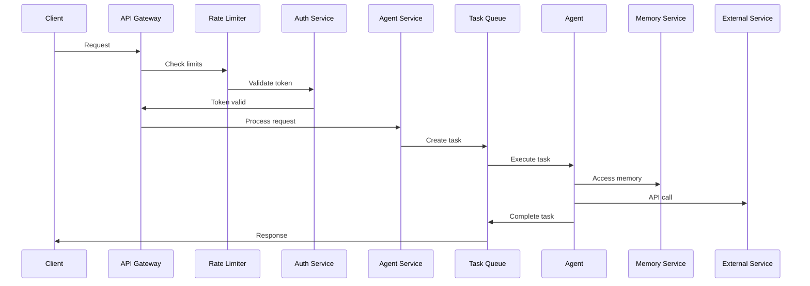
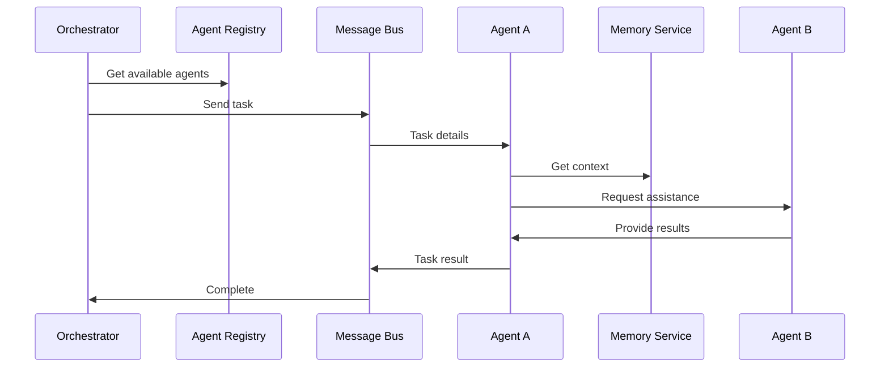
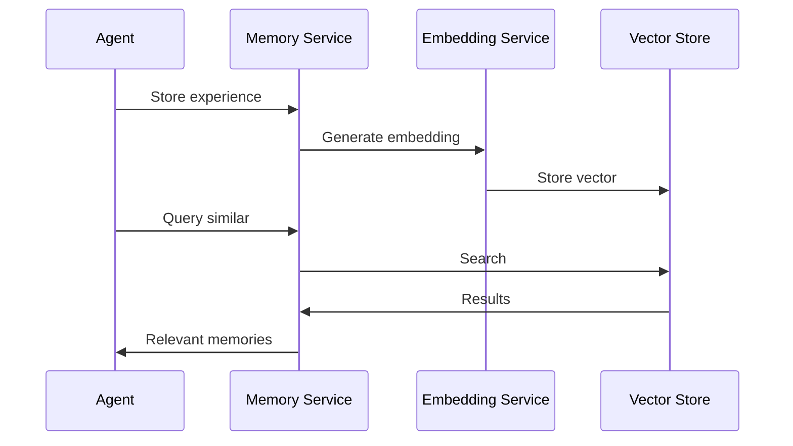

# System Architecture

## Overview
Solana Forensics is built as a distributed system with multiple specialized components working together to provide AI-powered blockchain analysis.

## System Components

### 1. Core Services

#### Agent Service
- Manages agent lifecycle
- Handles agent communication
- Coordinates task execution
- Maintains agent state

#### Memory Service
- Vector storage for agent memories
- Semantic search capabilities
- Memory consolidation and pruning
- Context management

#### Monitoring Service
- System health monitoring
- Performance metrics collection
- Error tracking and alerting
- Resource usage monitoring

#### Rate Limiting Service
- Request throttling
- Burst protection
- Fair usage enforcement
- Rate limit policy management

### 2. AI Agents

#### Analyst Agent
- Data analysis
- Pattern recognition
- Anomaly detection
- Trend prediction

#### Orchestrator Agent
- Workflow management
- Task coordination
- Resource allocation
- Error recovery

#### Researcher Agent
- Information gathering
- Document analysis
- Knowledge synthesis
- Source tracking

#### Coder Agent
- Code analysis
- Bug detection
- Optimization
- Documentation

#### Planner Agent
- Task planning
- Timeline management
- Resource scheduling
- Dependency tracking

#### Reviewer Agent
- Quality assessment
- Performance evaluation
- Feedback generation
- Improvement tracking

### 3. Data Storage

#### PostgreSQL Database
- Agent data
- Task history
- System configuration
- User data

#### Redis Cache
- Rate limiting
- Session data
- Real-time metrics
- Task queue

#### Pinecone Vector Store
- Agent memories
- Semantic embeddings
- Knowledge base
- Context vectors

### 4. External Services

#### OpenAI
- GPT-4 for analysis
- Embeddings generation
- Code understanding
- Natural language processing

#### Anthropic
- Claude for deep analysis
- Complex reasoning
- Safety checks
- Bias mitigation

#### Solana RPC
- Blockchain data access
- Transaction monitoring
- Account analysis
- Program interaction

## System Flow

### 1. Request Processing


### 2. Agent Communication


### 3. Memory Management


## Security Architecture

### 1. Authentication
- JWT-based authentication
- Role-based access control
- API key management
- Session handling

### 2. Authorization
- Fine-grained permissions
- Resource-level access control
- Agent capability restrictions
- API scope limitations

### 3. Data Protection
- End-to-end encryption
- Data anonymization
- Secure key storage
- Audit logging

### 4. Network Security
- TLS encryption
- Rate limiting
- DDoS protection
- IP filtering

## Scalability

### 1. Horizontal Scaling
- Stateless services
- Load balancing
- Service discovery
- Auto-scaling

### 2. Data Partitioning
- Database sharding
- Memory partitioning
- Cache distribution
- Load distribution

### 3. Performance Optimization
- Query optimization
- Caching strategy
- Background processing
- Resource pooling

## Monitoring and Observability

### 1. Metrics Collection
- System metrics
- Business metrics
- Agent metrics
- User metrics

### 2. Logging
- Structured logging
- Log aggregation
- Error tracking
- Audit trails

### 3. Alerting
- Health checks
- Performance alerts
- Error notifications
- Usage alerts

### 4. Dashboards
- System overview
- Agent performance
- User activity
- Resource usage

## Deployment Architecture

### 1. Infrastructure
- Kubernetes clusters
- Load balancers
- CDN
- Storage systems

### 2. CI/CD
- Automated testing
- Deployment pipelines
- Version control
- Environment management

### 3. Disaster Recovery
- Backup strategy
- Failover systems
- Data replication
- Recovery procedures

## Development Guidelines

### 1. Code Organization
```
src/
├── agents/           # AI agent implementations
├── services/         # Core services
├── api/             # API endpoints
├── lib/             # Shared libraries
├── types/           # TypeScript types
├── utils/           # Utility functions
└── config/          # Configuration
```

### 2. Best Practices
- Type safety
- Error handling
- Testing
- Documentation
- Performance
- Security

### 3. Development Workflow
- Feature branches
- Code review
- Testing
- Documentation
- Deployment

## Future Considerations

### 1. Planned Improvements
- Advanced analytics
- Machine learning models
- Real-time processing
- Enhanced security

### 2. Scalability Enhancements
- Global distribution
- Edge computing
- Enhanced caching
- Optimized storage

### 3. New Features
- Advanced visualization
- Automated responses
- Enhanced collaboration
- Extended integrations 